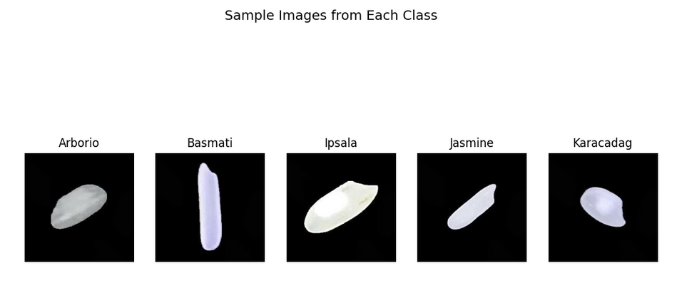
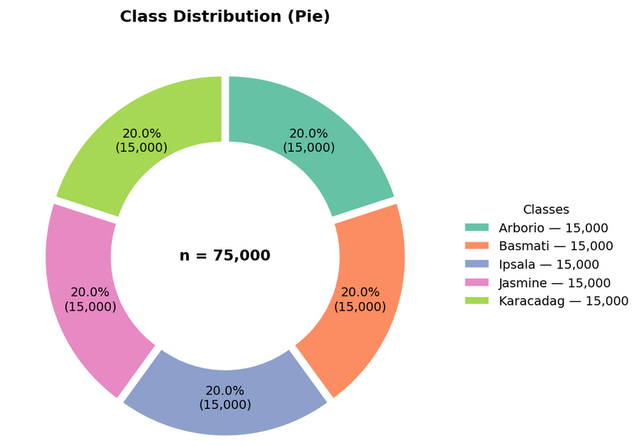
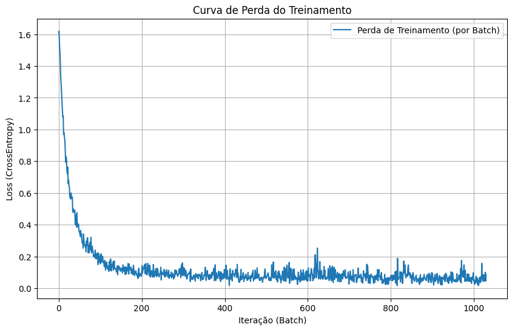

# 🍚 Classificação de Tipos de Arroz com PyTorch

## 📌 Visão Geral

Este projeto desenvolveu um modelo de **Deep Learning (Rede Neural MLP)** utilizando o framework **PyTorch** para classificar automaticamente imagens de grãos de arroz em 5 variedades genéticas distintas.

O objetivo foi demonstrar como uma arquitetura de rede neural simples, baseada em **Regressão Softmax**, pode atingir alta performance em tarefas de visão computacional.

### Amostra do Dataset
Abaixo, exemplos das variedades classificadas pelo modelo:

---

## 🗂️ Análise Exploratória (EDA)

Foi utilizado o **Rice Image Dataset** (75.000 imagens). A primeira etapa foi garantir o balanceamento das classes para evitar viés no modelo.

*O dataset está perfeitamente balanceado com 15.000 amostras por classe.*

---

## ⚙️ Arquitetura e Treinamento

Optou-se por uma abordagem eficiente usando **Perceptron Multicamadas (MLP)**.

* **Entrada:** Imagens 28x28 (achatadas para vetor de 784 posições).
* **Otimizador:** Adam.
* **Função de Perda:** CrossEntropyLoss.

### Desempenho do Treinamento
O gráfico abaixo mostra a convergência rápida do modelo (queda da perda e aumento da acurácia):

---

## 🏆 Resultados Finais

O modelo demonstrou um aprendizado extremamente rápido e eficaz.

| Métrica | Resultado Final |
| :--- | :---: |
| **Acurácia na Validação** | **99.22%** |
| **Perda (Loss) Final** | **0.0322** |

### Matriz de Confusão
A matriz abaixo detalha os acertos por classe, evidenciando a robustez do classificador:

---

## 🏆 Resultados

O modelo demonstrou um aprendizado extremamente rápido e eficaz, convergindo para uma acurácia excelente em poucas épocas.

| Métrica | Resultado Final |
| :--- | :---: |
| **Acurácia na Validação** | **99.22%** |
| **Perda (Loss) Final** | **0.0322** |

👨‍💻 Autor

Alexander Lira Data Scientist | Deep Learning Enthusiast

